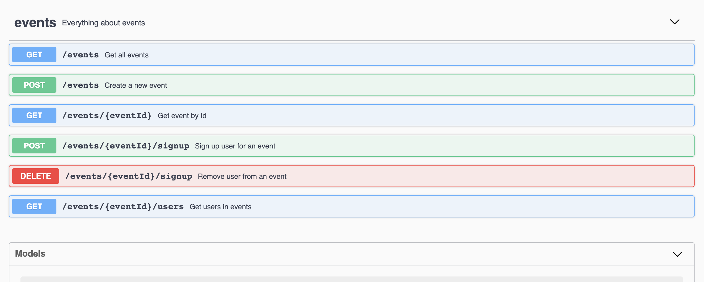
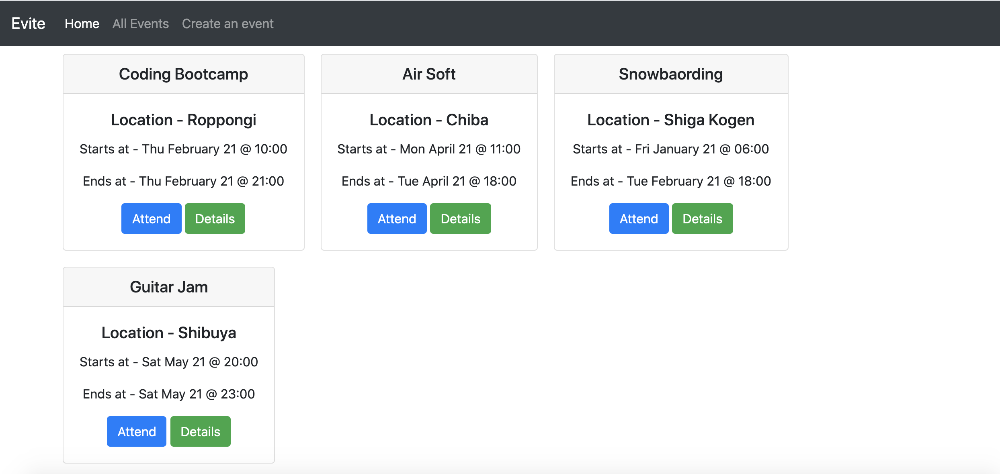

# Evite

Event management app

## Starting application

```shell
git clone https://github.com/anandjoshi91/evite
cd evite
docker build -t evite:latest .
docker-compose up
```

## API Documentation

After starting the application follow - http://0.0.0.0:8080/api/docs to start swagger ui.



## UI

Default UI - http://0.0.0.0:8080/


## Config

Override default config in `config.py`
